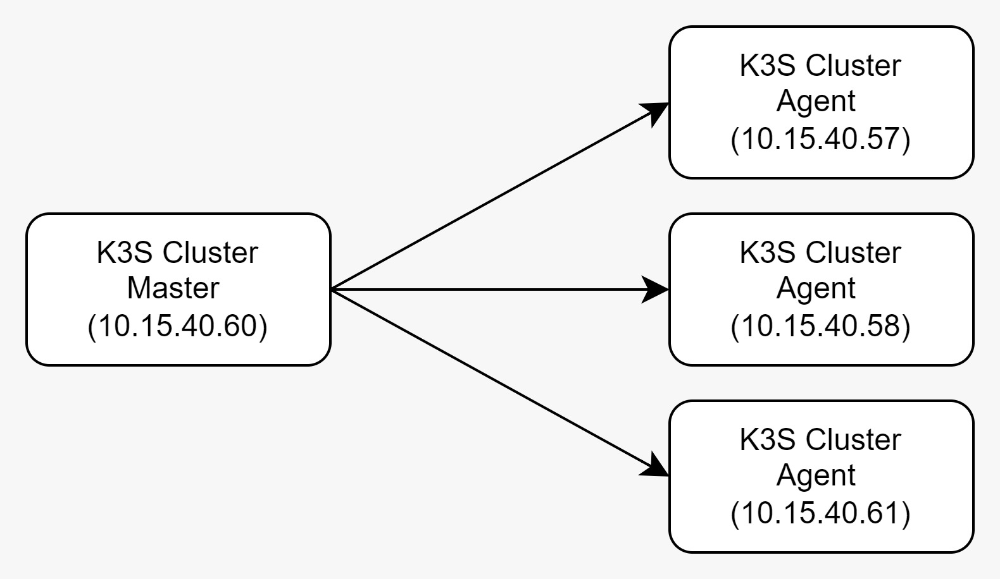
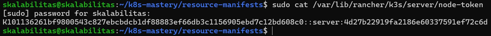
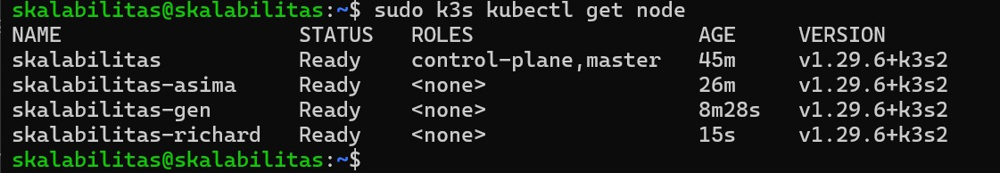
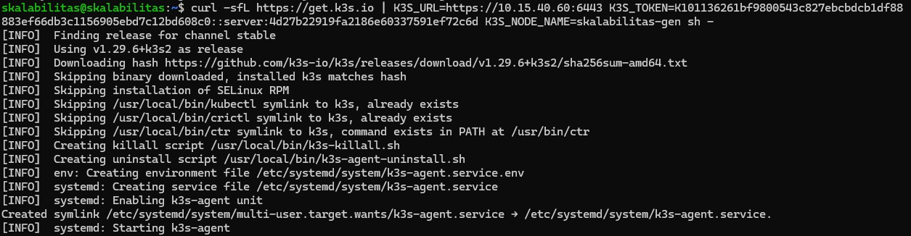
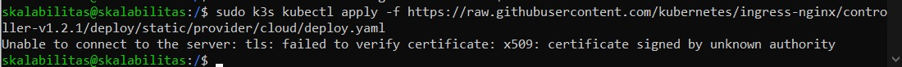

# Laporan Hasil Final Project Skalabilitas
## Anggota kelompok
| NRP        | Nama                          | IP Server (VM) |
|------------|-------------------------------|----------------|
| 5027201009 | Asima Prima Yohana Tampubolon | 10.15.40.57    |
| 5027201021 | Richard Nicolas               | 10.15.40.58    |
| 5027201051 | Satrio Kamil Widhiwoso        | 10.15.40.60    |
| 5027201061 | Gennaro Fajar Mennde           | 10.15.40.61    |

# Langkah Pengerjaan
## Arsitektur Sistem
Pada pengerjaan final project, penggunaan kluster menggunakan K3S dengan 4 node, 1 node master, dan 3 node agent. Arsitektur sistem dapat ditemukan pada gambar berikut\

Node **master** yang digunakan adalah IP **10.15.40.60** dan node **agent** yang digunakan adalah **10.15.40.57, 10.15.40.58, 10.15.40.61**
## Setup K3S pada setiap node (VM) 
### Node Server
1. Install K3S pada node server dengan perintah berikut
```
curl -sfL https://get.k3s.io | sh -
```
2. Dapatkan token node server dengan menggunakan command berikut
```
sudo cat /var/lib/rancher/k3s/server/node-token
```
Hasil dari command dapat dilihat pada gambar berikut

3. Koneksi node agent ke node server, setelah terkoneksi akan dilakukan pengecekan dengan command\
```
sudo k3s kubectl get node
```
Hasil dari command tersebut dapat dilihat pada gambar berilkut ini\

### Node Agent
1. Install K3S pada node agent dengan menggunakan command berikut ini
```
curl -sfL https://get.k3s.io | K3S_URL=https://<<ip-master>>:6443 K3S_TOKEN=<<master-token>> K3S_NODE_NAME=<<agent-name>> sh -
```
Hasil pada node agent terlihat seperti gambar berikut ini\



## Kendala yang dihadapi
Terdapat kendala pada saat install dependencies pada node, terlihat pada gambar berikut\
